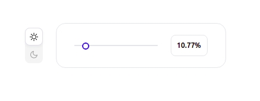
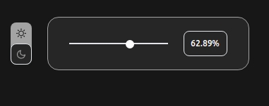

# DarkModeSwitcher
A passenger's order form like on RZD website. 

## Stack
React, Tailwind CSS, CSS

## Requirements:
* Use Tailwind CSS v.2 for your layout
* Set up an interaction between input and slider
* Create a light/dark mode toggle by using Tailwind Dark Mode

## How to start

```
cd frontend/

yarn install
yarn start
```



